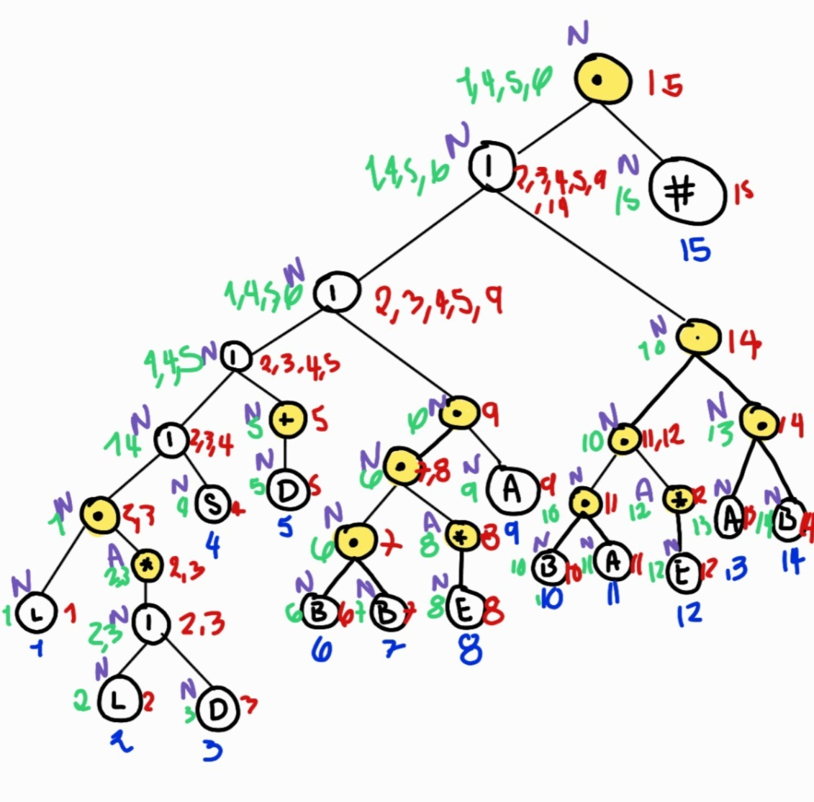
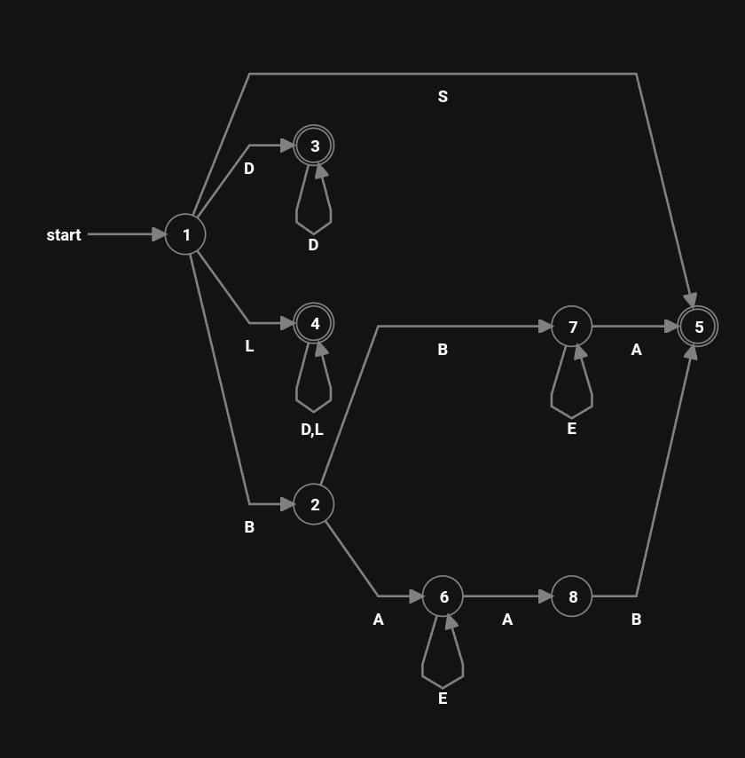
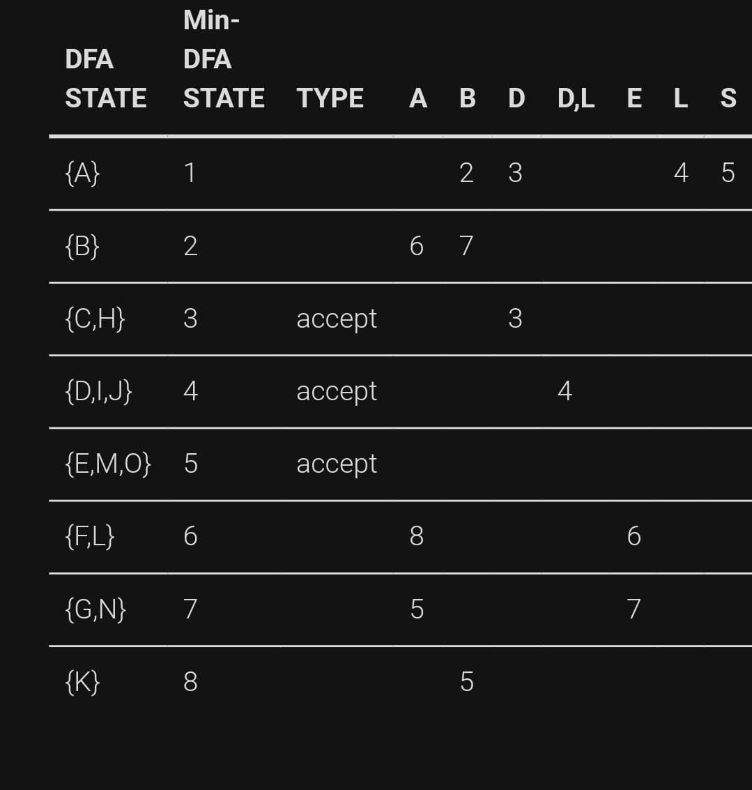

# Manual Técnico


Este documento técnico presenta un innovador sistema de desarrollo web que integra las capacidades de múltiples lenguajes de programación, específicamente Fortran y Python, para crear una solución robusta de generación de páginas web. El sistema implementa una metodología única que permite a los desarrolladores definir interfaces web utilizando una sintaxis inspirada en Java, facilitando así la transición para programadores familiarizados con este último lenguaje.


## Arquitectura del sistema
### Componentes Principales

1. Analizador Léxico

- Funciona como primera capa de procesamiento
- Descompone el código fuente en tokens individuales
- Identifica y clasifica elementos como:
  - Palabras clave
  - Identificadores
  - Operadores
  - Símbolos especiales
  - Literales

2. Analizador Sintáctico

- Procesa los tokens generados por el analizador léxico
- Verifica la estructura gramatical del código
- Construye árboles de sintaxis abstracta (AST)
- Valida las relaciones jerárquicas entre elementos
- Asegura el cumplimiento de las reglas de la gramática definida

## Integración de Lenguajes
### Papel de Python

- Gestión principal del front-end del sistema
- Procesamiento de datos y manipulación de estructuras
- Implementación de la lógica de análisis léxico
- Manejo de entrada/salida y comunicación con el usuario

### Papel de Fortran

- Procesamiento de operaciones computacionalmente intensivas
- Optimización de cálculos matemáticos complejos
- Gestión de recursos del sistema
- Procesamiento paralelo cuando sea necesario
- Manipulación eficiente de grandes conjuntos de datos

## Flujo de Trabajo del Sistema

1. Fase de Entrada

- El usuario proporciona código en la sintaxis específica del sistema
- Se realiza una validación inicial de la entrada
- Se preparan los datos para el procesamiento


2. Fase de Análisis

- El analizador léxico tokeniza la entrada
- Se genera una secuencia de tokens estructurada
- El analizador sintáctico procesa los tokens
- Se construye una representación intermedia del código


## Consideraciones Técnicas
### Requisitos del Sistema

- Intérpretes de Python y Fortran instalados
- Dependencias específicas de cada lenguaje
- Configuración adecuada del entorno de desarrollo

### Limitaciones y Consideraciones

- Necesidad de gestionar la comunicación entre lenguajes
- Overhead potencial en la integración
- Requisitos de memoria y procesamiento

## Instalación y Requisitos del Sistema

### Requisitos de Hardware
- Procesador: 1.6 GHz o superior
- Memoria RAM: 4 GB mínimo (8 GB recomendado)
- Espacio en disco: 500 MB de espacio libre
- Conexión a Internet (para la instalación de componentes)

### Requisitos de Software
#### Compilador Fortran
1. **Instalación de gfortran**
- Descargar el instalador desde: [fortran-lang.org](https://fortran-lang.org/learn/os_setup/install_gfortran/)
- Durante la instalación, **importante**: Seleccionar la opción para agregar automáticamente al PATH
- Verificar la instalación en terminal mediante:
```bash
    gfortran --version
 ```

#### Python y Dependencias
1. **Python**
- Versión recomendada: 3.8 o superior
- Verificar instalación:
```bash
    python --version
```

2. **Bibliotecas Requeridas**
- Tkinter (interfaz gráfica):
 ```bash
    pip install tk
 ```


## Expresión regular generada por el analizador léxico

``` L(L|D)*|S|D+|BBE*A|BAE*AB ```

### Leyenda de Patrones:

L: Representa una letra (A-Z|a-z)

D: Representa un dígito (0-9)

S: Representa un símbolo especial (;|-|<|>|!|,|.|"|(|))

B: Representa una barra diagonal (/)

E: Representa cualquier carácter excepto asterisco

A: Representa un asterisco (*)

## Método del Árbol implementado para el desarrollo del Automata Finito Determinista



## Automata Finito Determinista


## Tabla de Transiciones


## Gramática Libre de Contexto

### Declaración de controles (Producciones iniciales)

```
<Control> ::= 
    | "etiqueta" <ID> ";"
    | "boton" <ID> ";"
    | "check" <ID> ";"
    | "radioBoton" <ID> ";"
    | "texto" <ID> ";"
    | "areaTexto" <ID> ";"
    | "clave" <ID> ";"
    | "contenedor" <ID> ";"
```

### Propiedades y métodos

```
<Propiedad> ::= <ID> "." <MetodoSet>

<MetodoSet> ::= 
    | "setAncho" "(" <valor> ")"
    | "setAlto" "(" <valor> ")"
    | "setTexto" "(" <texto> ")"
    | "setColorLetra" "(" <R> "," <G> "," <B> ")"
    | "setPosicion" "(" <X> "," <Y> ")"
    | "setAlineacion" "(" <alineacion> ")"
    | "setColorFondo" "(" <R> "," <G> "," <B> ")"
    | "setMarcada" "(" <valor> ")"
    | "setGrupo" "(" <grupo> ")"
```
### Compatibilidad de Métodos por Control:


- Etiqueta:

  - setAncho
  - setAlto
  - setTexto
  - setColorLetra
  - setPosicion
  - setColorFondo


- Botón:

  - setTexto
  - setPosicion
  - setAlineacion


- Check:

  - setTexto
  - setPosicion
  - setMarcada


- RadioBotón:

  - setTexto
  - setPosicion
  - setMarcada
  - setGrupo


- Texto:

  - setTexto
  - setPosicion
  - setAlineacion


- AreaTexto:

  - setTexto
  - setPosicion


- Clave:

  - setTexto
  - setPosicion
  - setAlineacion


- Contenedor:

  - setAncho
  - setAlto
  - setPosicion
  - setColorFondo

## Modulos de Fortran

### Modulo error

Modulo que se encarga de almacenar los errores que pueden encontrarse en el lenguaje recibido desde Python, es capaz de devolver los errores a Python a través de un archivo JSON.

``` Fortran
MODULE error
    implicit none

    type :: Err
        character(len=10) :: tipo
        integer :: fila
        integer:: columna
        CHARACTER(LEN = 100) :: ultimo_token
        CHARACTER(LEN = 100) :: descripcion
        
    End type Err

    ! Declaración de un arreglo de Err para almacenar los errores
    type(Err), ALLOCATABLE ::  error_array(:)

contains 
```

### Modulo etiqueta

Modulo para almacenar las etiquetas que vienen en el lenguaje y que es capaz de asignarle sus propiedades.

``` Fortran
MODULE etiqueta
    implicit none

    type :: Tag
        CHARACTER(LEN = 50) :: id
        CHARACTER(LEN = 20) :: alto
        CHARACTER(LEN = 20) :: ancho
        CHARACTER(LEN = 200) :: texto
        CHARACTER(LEN = 50) :: color_texto_r
        CHARACTER(LEN = 50) :: color_texto_g
        CHARACTER(LEN = 50) :: color_texto_b
        CHARACTER(LEN = 50) :: color_fondo_r
        CHARACTER(LEN = 50) :: color_fondo_g
        CHARACTER(LEN = 50) :: color_fondo_b
        CHARACTER(LEN = 50) :: posicion_x
        CHARACTER(LEN = 50) :: posicion_y
    End type Tag

    ! Declaración de un arreglo de Tag para almacenar los etiquetas
    type(Tag), ALLOCATABLE ::  etiqueta_array(:)
    

contains
```

### Modulo boton

Modulo para almacenar los botones que vienen en el lenguaje y que es capaz de asignarle sus propiedades.

``` Fortran
MODULE boton
    implicit none

    type :: Button
        CHARACTER(LEN = 50) :: id
        CHARACTER(LEN = 20) :: alto
        CHARACTER(LEN = 20) :: ancho
        CHARACTER(LEN = 200) :: texto
        CHARACTER(LEN = 20) :: alineacion
        CHARACTER(LEN = 50) :: posicion_x
        CHARACTER(LEN = 50) :: posicion_y
    End type Button

    ! Declaración de un arreglo de Tag para almacenar los etiquetas
    type(Button), ALLOCATABLE ::  boton_array(:)

contains
```

### Modulo check

Modulo para almacenar los checks que vienen en el lenguaje y que es capaz de asignarle sus propiedades.

``` Fortran
MODULE check
implicit none

    type :: CheckBox
        CHARACTER(LEN = 50) :: id
        CHARACTER(LEN = 20) :: alto
        CHARACTER(LEN = 20) :: ancho
        CHARACTER(LEN = 200) :: texto
        CHARACTER(LEN = 10) :: marcado
        CHARACTER(LEN = 50) :: grupo
        CHARACTER(LEN = 50) :: posicion_x
        CHARACTER(LEN = 50) :: posicion_y
    End type CheckBox

    ! Declaración de un arreglo de Tag para almacenar los etiquetas
    type(CheckBox), ALLOCATABLE ::  check_array(:)

contains
```

### Modulo radioBoton

Modulo para almacenar los radioBotons que vienen en el lenguaje y que es capaz de asignarle sus propiedades.

``` Fortran
MODULE radioBoton
implicit none

    type :: RadioButton
        CHARACTER(LEN = 50) :: id
        CHARACTER(LEN = 20) :: alto
        CHARACTER(LEN = 20) :: ancho
        CHARACTER(LEN = 200) :: texto
        CHARACTER(LEN = 5) :: marcado
        character(LEN = 50) :: grupo
        CHARACTER(LEN = 50) :: posicion_x
        CHARACTER(LEN = 50) :: posicion_y
    End type RadioButton

    ! Declaración de un arreglo de Tag para almacenar los etiquetas
    type(RadioButton), ALLOCATABLE ::  radioBoton_array(:)

contains
```

### Modulo texto

Modulo para almacenar los textos que vienen en el lenguaje y que es capaz de asignarle sus propiedades.

``` Fortran
MODULE texto
implicit none

    type :: Text
        CHARACTER(LEN = 50) :: id
        CHARACTER(LEN = 20) :: alto
        CHARACTER(LEN = 20) :: ancho
        CHARACTER(LEN = 200) :: texto
        CHARACTER(LEN = 20) :: alineacion
        CHARACTER(LEN = 50) :: posicion_x
        CHARACTER(LEN = 50) :: posicion_y
    End type Text

    ! Declaración de un arreglo de Tag para almacenar los etiquetas
    type(Text), ALLOCATABLE ::  texto_array(:)

contains
```

### Modulo areaTexto

Modulo para almacenar las areaTextos que vienen en el lenguaje y que es capaz de asignarle sus propiedades.

``` Fortran
MODULE areaTexto
implicit none

    type :: TextArea
        CHARACTER(LEN = 50) :: id
        CHARACTER(LEN = 20) :: alto
        CHARACTER(LEN = 20) :: ancho
        CHARACTER(LEN = 200) :: texto
        CHARACTER(LEN = 50) :: posicion_x
        CHARACTER(LEN = 50) :: posicion_y
    End type TextArea

    ! Declaración de un arreglo de Tag para almacenar los etiquetas
    type(TextArea), ALLOCATABLE ::  areaTexto_array(:)

contains
```

### Modulo clave

Modulo para almacenar las claves que vienen en el lenguaje y que es capaz de asignarle sus propiedades.

``` Fortran
MODULE clave
implicit none

    type :: Password
        CHARACTER(LEN = 50) :: id
        CHARACTER(LEN = 20) :: alto
        CHARACTER(LEN = 20) :: ancho
        CHARACTER(LEN = 200) :: texto
        CHARACTER(LEN =20) :: alineacion
        CHARACTER(LEN = 50) :: posicion_x
        CHARACTER(LEN = 50) :: posicion_y
    End type Password

    ! Declaración de un arreglo de Tag para almacenar los etiquetas
    type(Password), ALLOCATABLE ::  clave_array(:)

contains
```

### Modulo contenedor

Modulo para almacenar las contenedores que vienen en el lenguaje y que es capaz de asignarle sus propiedades.

``` Fortran
MODULE contenedor
implicit none

    type :: Container
        CHARACTER(LEN = 50) :: id
        CHARACTER(LEN = 20) :: alto
        CHARACTER(LEN = 20) :: ancho
        CHARACTER(LEN = 50) :: color_fondo_r
        CHARACTER(LEN = 50) :: color_fondo_g
        CHARACTER(LEN = 50) :: color_fondo_b
        CHARACTER(LEN = 50) :: posicion_x
        CHARACTER(LEN = 50) :: posicion_y
    End type Container

    ! Declaración de un arreglo de Tag para almacenar los etiquetas
    type(Container), ALLOCATABLE ::  contenedor_array(:)

contains
```

### Modulo token

Modulo para almacenar las tokens que vienen en el lenguaje y este modulo es capaz de asignarle sus propiedades a los tokens y ademas de realizar un análisis sintáctico a partir de ellos.

``` Fortran
MODULE token
    use error
    use etiqueta
    use boton
    use check
    use radioBoton
    use texto
    use areaTexto
    use clave
    use contenedor

    implicit none

    type :: Tkn
        CHARACTER(LEN = 100) :: lexema
        CHARACTER(LEN = 200) :: tipo 
        integer :: fila
        integer :: columna
    End type Tkn

    ! Declaración de un arreglo de Tkn para almacenar los tokens
    type(Tkn), ALLOCATABLE ::  token_array(:)
    

contains
```

### Programa analizador_lexico

Programa el cual es un punto de arranque para el backend del proyecto, este se encarga de realizar un análisis léxico de todo el contenido enviado desde Python y poco a poco va accediendo a los demás modulos.

``` Fortran
program analizador_lexico
    use error
    use token

    implicit none
    integer :: len, fila, columna, estado, puntero
    integer :: ios, unidad
    character(len=100000) :: contenido, buffer
    character(len=1) :: char
    character(len=100) :: aux_tkn
    logical :: comentario_linea
    integer :: numErrores

    estado = 0
    puntero = 1
    columna = 0
    fila = 1
    aux_tkn = ""
    numErrores = 0

    contenido = ""

    comentario_linea = .false.

    unidad = 10

    
    do
        read(*, '(A)', IOSTAT=ios) buffer
        if (ios /= 0) exit
        contenido = trim(contenido) // trim(buffer) // new_line('a') ! concatenamos el
        !contenido mas lo que viene en el buffer y como leemos por el salto de linea al final
    end do
```

