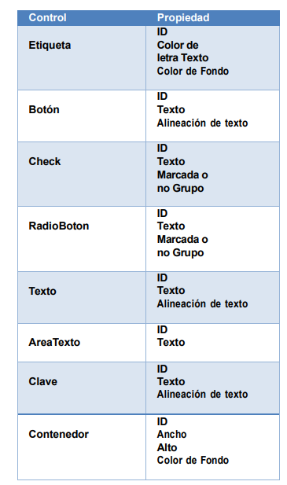
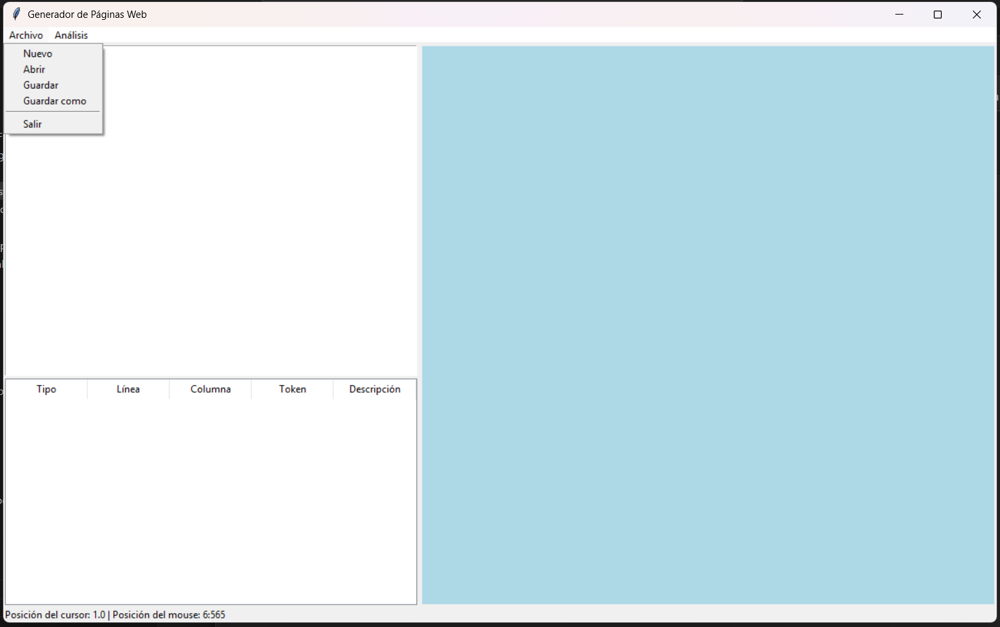
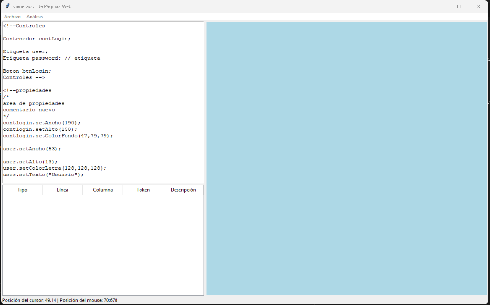
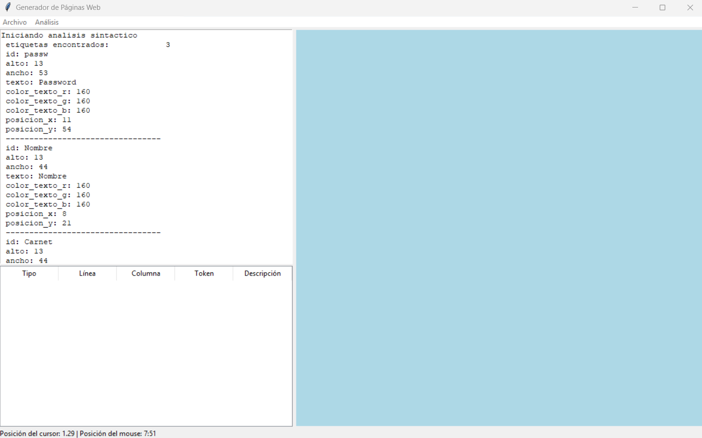

# Manual de Usuario
¡Bienvenido al Generador de Páginas Web! A continuación se te presentará un manual de uso de este programa.


Lo primero que puedes observar es que tienes un TextArea en el que puedes ingresar texto, pero debes seguir la estructura definida por el lenguaje.

La estructura es la siguiente:

Tendras 3 bloques principales

## Bloque Controles

```
<!--Controles
/*
Contenido del bloque
*/
Controles-->
```

En este bloque se definen todos los componentes que decidiras utilizar en tu página web, los definiras de la siguiente forma:

```
Control id ;
```

En el que cada control tiene sus propiedades y puede ser cualquiera de los siguientes:



Y el id puede ser cualquier nombre que deseemos darle al control, el ; sirve unicamente para cerrar la linea de definición del control.

## Bloque Propiedades

```
<!--Propiedades
/*
Contenido del bloque
*/
Propiedades-->
```
En este bloque se tienen todas las siguientes instrucciones, las cuales sirven para darle valores a las propiedades de nuestros controles:

```
setAncho, setAlto, setColorFondo, setColorLetra, setTexto, setAlineacion, setMarcada, setGrupo, setAncho, setAlto,
```
Las lineas de codigo seguiran la siguiente estructura:
```
Control.propiedad(valor[, valor]*);
```

### Bloque Colocación (no terminado)

```
<!--Colocacion
/*
Contenido del bloque
*/
Colocacion-->
```

En este bloque se pueden implementar diferentes opciones para colocar los controles.

Estas son las instrucciones que se usan dentro del lenuaje:

```
setPosicion, add y this (estas 2 últimas no han sido terminadas)

```

La forma de implementar correctamente el setPosicion es la siguiente:

```
Control.setPosicion(x, y);
```

Ahora que ya se tiene explicado lo básico con relación al lenguaje que se puede utilizar, procederemos a lo siguiente.



Al presionar el botón archivo tendremos diferentes opciones.

### Opción Nuevo
Crea un nuevo archivo desde 0, primero consultandote si deseas guardar el que está apunto de borrarse.

### Opcion Abrir
Sirve para abrir archivos con la terminación LFP dentro de tu ordenador.

### Opción Guardar 
Sirve para guardar los cambios en nuestro archivo una vez ya se haya almacenado en el ordenador, en caso contrario nos dará la opción de escoger donde guardarlo.

### Opción Guardar como
Sl escoger está opción, podrás guardar tu archivo y siempre escoger en donde deseas guardarlo.

En esté momento se procede a abrir un archivo



Una vez abierto el archivo podemos observar como se despliega todo el contenido de esta en la TextArea.

Teniendo ya el contenido preparado, podemos darle a la opción de Análisis, está opcion procesara el lenguaje.



Una vez enviados los datos, estos volverán procesados léxica y sintáctimamente.